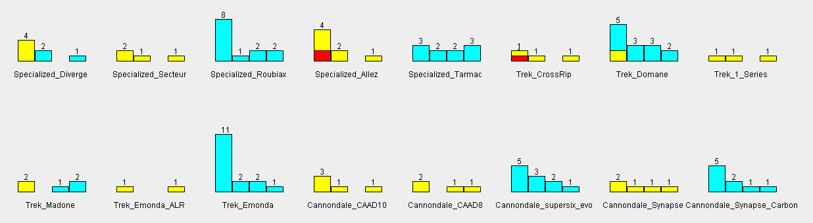

# Bicycle cost infographic generator

Branch `histogram_with_color` has an implementation of the Histogram which shows stacked materials in each bar.

<!-- need to use html to center -->

This version of the Histogram makes you compare models to each other, but the histogram should compare versions within a model. I went back to the solid black Histogram and preserved the colored version here.
